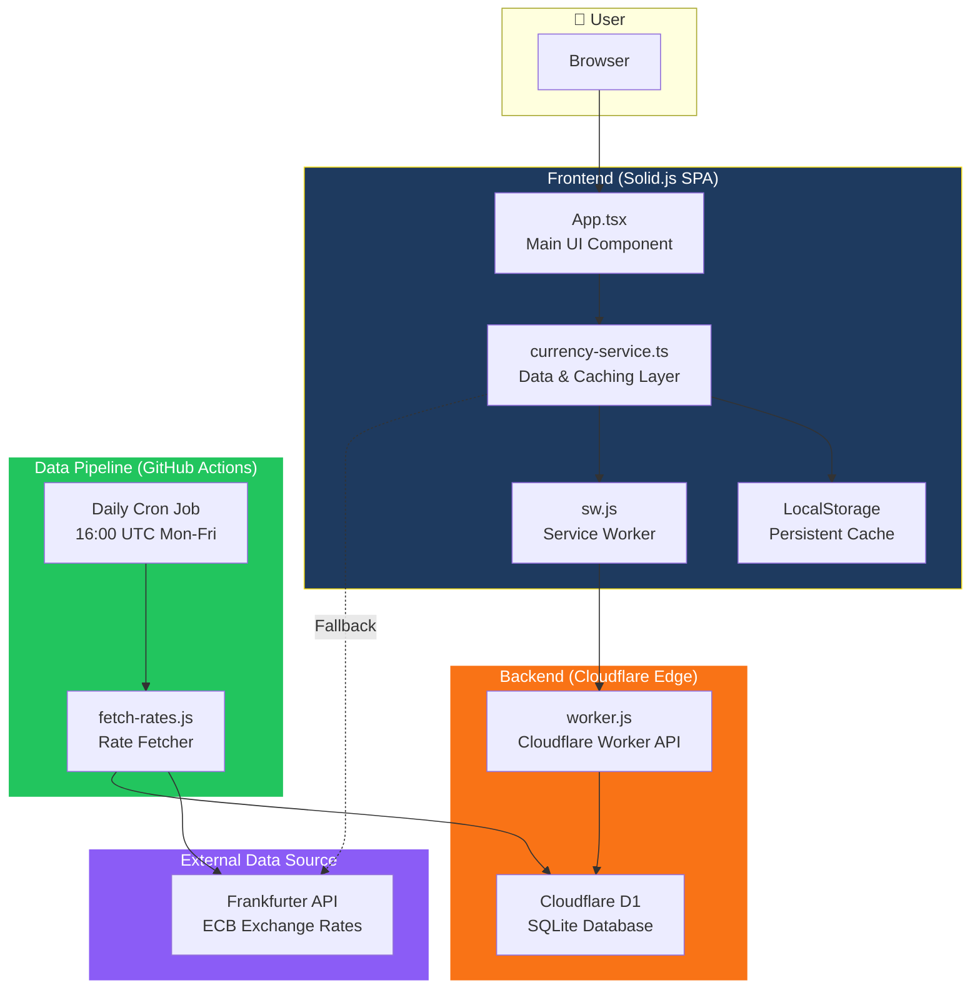
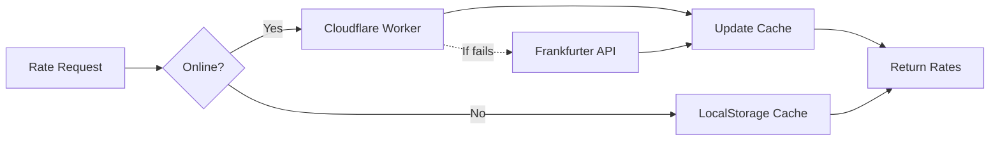

# Currency Converter

A modern, offline-first currency converter built with Solid.js, Tailwind CSS, and the Frankfurter API. Features real-time exchange rates with beautiful country flags and seamless offline functionality.

## ✨ Features

- **🌍 Real-time Exchange Rates**: Powered by the Frankfurter API
- **🏴 Country Flags**: Visual currency selection with flag emojis
- **📱 Offline-First**: Works without internet connection using cached data
- **🔄 Manual Refresh**: Update rates when online with new data available
- **📊 Status Indicator**: Shows online/offline status and last update time
- **🎨 Beautiful UI**: Modern design with Tailwind CSS
- **⚡ Fast Performance**: Built with Solid.js and Vite
- **📲 PWA Ready**: Service worker for offline functionality

## 📐 How It Works

PocketFX is built on a 3-tier architecture with offline-first design principles. The system ensures fast, reliable currency conversions even without an internet connection.

### Architecture Diagram



### Data Flow

1. **User Opens App**: The Solid.js frontend loads and checks LocalStorage for cached rates
2. **Initial Fetch**: If no cached data exists, `CurrencyService` requests rates from the Cloudflare Worker API
3. **Caching**: Rates are cached in memory and LocalStorage for offline access
4. **Real-time Conversion**: As users type, conversions happen instantly using cached rates
5. **Background Updates**: Every 30 seconds, the app checks if newer rates are available
6. **Manual Refresh**: Users can tap "Update rates" when new data is detected

### Frontend Architecture

| Component | Purpose |
|-----------|---------|
| **App.tsx** | Main UI with currency selectors, amount input, and conversion display |
| **currency-service.ts** | Manages rate fetching, caching, and conversion calculations |
| **Service Worker** | Caches API responses for offline functionality |
| **LocalStorage** | Persists exchange rates and user preferences |

### Backend Architecture

| Component | Purpose |
|-----------|---------|
| **Cloudflare Worker** | Serverless API serving rates from edge locations worldwide |
| **D1 Database** | SQLite database storing 44 currencies with daily rate history |
| **GitHub Actions** | Automated daily workflow fetching rates from European Central Bank |

### API Endpoints

| Endpoint | Method | Description |
|----------|--------|-------------|
| `/api/rates` | GET | Fetch exchange rates (supports `from`, `to`, `date` params) |
| `/api/metadata` | GET | Last fetch time, total currencies, data source |
| `/api/status` | GET | Cache status and new data availability |
| `/api/health` | GET | Health check (no auth required) |

### Offline-First Strategy



The app uses a **network-first** strategy with multiple fallback layers:
1. **Primary**: Cloudflare Worker API (fast, globally distributed)
2. **Secondary**: Frankfurter API (reliable public endpoint)
3. **Tertiary**: LocalStorage cache (always available offline)

## 🚀 Getting Started

### Prerequisites

- Node.js 18 or later
- npm or yarn

### Installation

1. Clone the repository or use this project
2. Install dependencies:

   ```bash
   npm install
   ```

3. Start the development server:

   ```bash
   npm run dev
   ```

4. Open your browser and navigate to `http://localhost:3000` (or the port shown in terminal)

### Deploying the Cloudflare Worker

To deploy the currency API worker to Cloudflare:

1. Install Wrangler CLI (if not already):

   ```sh
   npm install -g wrangler
   ```

2. Authenticate Wrangler with your Cloudflare account:

   ```sh
   wrangler login
   ```

3. Deploy the worker:
   ```sh
   wrangler deploy cloudflare/worker.js
   ```

Make sure your `wrangler.toml` is configured correctly in the `cloudflare/` directory.

For offline development and testing:

1. **Open Dev Panel**: Click the "🛠️ Dev Tools" button in the bottom-left corner of the app
2. **Enable Mock Data**: Toggle "Use Mock Data" in the dev panel
3. **Test Scenarios**: Simulate offline mode, slow network, or other conditions

**Browser Console Commands:**

```javascript
// Enable mock data
CurrencyDevUtils.enableMockData();

// Simulate offline mode
CurrencyDevUtils.setNetworkCondition("offline");

// Test conversion scenarios
const service = getCurrencyService();
console.table(service.testConversionScenarios());
```

See [Mock Data Guide](src/mock/MOCK_DATA.md) for complete testing documentation.

### GitHub Actions Setup (Optional)

For automated daily rate fetching with Cloudflare D1:

1. Follow the detailed setup guide in [SETUP.md](SETUP.md)
2. Configure your Cloudflare D1 database
3. Set up GitHub repository secrets
4. Deploy the GitHub Actions workflow

### Build for Production

```bash
npm run build
```

### Preview Production Build

```bash
npm run preview
```

## 🏗️ Architecture

### Tech Stack

- **Frontend Framework**: [Solid.js](https://solidjs.com) - Reactive UI library
- **Build Tool**: [Vite](https://vitejs.dev) - Fast development and build tool
- **Styling**: [Tailwind CSS](https://tailwindcss.com) - Utility-first CSS framework
- **API**: [Frankfurter](https://frankfurter.app) - Free currency exchange rates
- **PWA**: Service Worker for offline functionality
- **TypeScript**: Type safety and better developer experience

### Project Structure

```
src/
├── App.tsx              # Main application component
├── index.tsx            # Application entry point
├── index.css            # Global styles (Tailwind imports)
├── types.ts             # TypeScript type definitions
└── currency-service.ts  # Currency data service and caching

public/
├── sw.js               # Service worker for offline functionality
└── manifest.json       # PWA manifest

├── index.html          # HTML entry point
├── vite.config.ts      # Vite configuration
├── tailwind.config.js  # Tailwind CSS configuration
└── tsconfig.json       # TypeScript configuration
```

## 💱 Supported Currencies

The app supports 30+ major world currencies including:

- 🇺🇸 USD (US Dollar)
- 🇪🇺 EUR (Euro)
- 🇬🇧 GBP (British Pound)
- 🇯🇵 JPY (Japanese Yen)
- 🇰🇷 KRW (South Korean Won)
- 🇨🇳 CNY (Chinese Yuan)
- 🇮🇳 INR (Indian Rupee)
- And many more...

## � GitHub Actions Integration

This project includes a complete GitHub Actions workflow for automated daily exchange rate fetching:

### Features

- **🕘 Daily Schedule**: Automatically fetches rates at 9 AM UTC
- **☁️ Cloudflare D1**: Stores data in edge database for global access
- **🔄 Smart Caching**: Only updates when new data is available
- **📊 Monitoring**: Generates summaries and health reports
- **🚨 Alerts**: Optional Slack notifications on failures
- **🌍 Global CDN**: Data served from Cloudflare's edge network

### Files Included

- `.github/workflows/fetch-exchange-rates.yml` - Main workflow
- `scripts/fetch-rates.js` - Rate fetching script
- `scripts/update-cache-timestamp.js` - Cache management
- `scripts/generate-summary.js` - Monitoring reports
- `cloudflare/schema.sql` - Database schema
- `cloudflare/worker.js` - API worker (optional)
- `SETUP.md` - Complete setup guide

### Quick Setup

1. Create Cloudflare D1 database
2. Set GitHub repository secrets:
   - `CLOUDFLARE_API_TOKEN`
   - `CLOUDFLARE_ACCOUNT_ID`
   - `CLOUDFLARE_DATABASE_ID`
3. Run workflow manually to test
4. Enjoy automated daily updates!

See [SETUP.md](SETUP.md) for detailed instructions.

## �🔧 Key Features Explained

### Offline-First Design

- **Service Worker**: Caches API responses for offline use
- **Local Storage**: Stores exchange rates and user preferences
- **Smart Caching**: Automatically serves cached data when offline
- **Status Indicator**: Shows connection status and data freshness

### Real-time Updates

- **Auto-refresh**: Checks for new data every 30 seconds when online
- **Manual Update**: Button to manually fetch latest rates
- **Smart Fetching**: Only fetches when new data is available (>1 hour old)
- **Background Sync**: Updates cache without interrupting user experience

### User Experience

- **Visual Currency Selection**: Country flags make currency selection intuitive
- **Instant Conversion**: Real-time calculation as you type
- **Swap Functionality**: Quick button to swap from/to currencies
- **Responsive Design**: Works perfectly on desktop and mobile
- **Loading States**: Clear feedback during data fetching

## 🌐 API Integration

The app uses the [Frankfurter API](https://api.frankfurter.app) which provides:

- **Free Access**: No API key required
- **Real-time Data**: Updated daily from the European Central Bank
- **Reliable Service**: High uptime and fast response times
- **CORS Enabled**: Works directly from the browser

### API Endpoints Used

- `GET /latest?from={currency}` - Get latest exchange rates for a base currency

## 🔄 Service Worker

The service worker provides offline functionality by:

1. **Caching Static Assets**: HTML, CSS, JS files for offline access
2. **API Response Caching**: Stores exchange rate data for offline use
3. **Network-First Strategy**: Tries network first, falls back to cache
4. **Background Updates**: Keeps cache fresh when online

## 🚀 Deployment

### GitHub Actions Integration

The project is designed to work with GitHub Actions for automated data fetching:

1. **Daily Workflow**: Fetches fresh exchange rates daily
2. **Cloudflare D1 Integration**: Stores data in edge database
3. **Global Distribution**: Fast access worldwide

### Deployment Options

- **Netlify**: Zero-config deployment with edge functions
- **Vercel**: Serverless deployment with global CDN
- **Cloudflare Pages**: Edge deployment with D1 database
- **Static Hosting**: Works with any static file hosting

## 🤝 Contributing

1. Fork the repository
2. Create a feature branch
3. Make your changes
4. Add tests if applicable
5. Submit a pull request

## 📄 License

This project is open source and available under the [MIT License](LICENSE).

## 🙏 Acknowledgments

- [Frankfurter API](https://frankfurter.app) for providing free exchange rate data
- [Solid.js](https://solidjs.com) for the reactive framework
- [Tailwind CSS](https://tailwindcss.com) for the styling system
- [Vite](https://vitejs.dev) for the build tool
- Country flag emojis for visual currency representation

---

Built with ❤️ using Solid.js and modern web technologies.
